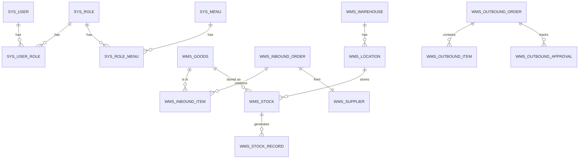

# 毕业论文

**题目**:基于 Spring Boot + Vue 3 的电商仓储物资管理系统的设计与实现
**学生**:____________
**指导教师**:____________

---

## 摘要

随着电子商务的蓬勃发展,仓储管理在电商企业运营中的地位日益凸显。传统人工管理方式效率低、易出错,难以满足电商"快速响应、零差错、可追溯"的要求。本文设计并实现了一套基于 Spring Boot 与 Vue 3 的前后端分离电商仓储物资管理系统(以下简称 WMS)。系统涵盖商品管理、库位管理、入库管理、出库管理、库存管理、盘点管理、库存预警等核心功能,支持管理员、仓库管理员、部门负责人、普通员工四类角色的协同工作。在技术实现上,后端采用 Spring Boot 2.7.18 + MyBatis-Plus + Sa-Token 实现 RESTful API 与 RBAC 鉴权,通过 `SELECT ... FOR UPDATE` 行级锁与事务保证库存并发安全;前端基于 Vue 3 + Element Plus + ECharts 实现响应式 SPA。系统已完成功能测试与集成测试,验证了业务流程的完整性与数据一致性,具备良好的可用性与可扩展性。

**关键词**:仓储管理系统;Spring Boot;Vue 3;库存预警;RBAC;电商

---

## Abstract

With the rapid development of e-commerce, warehouse management plays an increasingly important role in the operation of e-commerce enterprises. Traditional manual management is inefficient and error-prone, which is difficult to meet the requirements of "rapid response, zero error and traceability" in e-commerce. This paper designs and implements a front-end and back-end separated warehouse management system (WMS) based on Spring Boot and Vue 3. The system covers the core functions of commodity management, location management, inbound management, outbound management, inventory management, inventory counting, inventory warning, etc., and supports the collaborative work of four roles: administrator, warehouse manager, department leader and ordinary employee. In the technical implementation, the back-end uses Spring Boot 2.7.18 + MyBatis-Plus + Sa-Token to realize RESTful API and RBAC authentication, and ensures inventory concurrency security through `SELECT ... FOR UPDATE` row-level lock and transaction. The front-end uses Vue 3 + Element Plus + ECharts to realize responsive SPA. The system has completed functional test and integration test, which verifies the integrity of business process and data consistency, and has good usability and extensibility.

**Keywords**: Warehouse Management System; Spring Boot; Vue 3; Inventory Warning; RBAC; E-commerce

---

## 第 1 章 绪论

### 1.1 研究背景与意义

近年来,我国电子商务交易额持续增长,2025 年突破 15 万亿元。海量的 SKU、频繁的出入库、严格的批次管理对仓储系统提出了更高要求。根据中国仓储协会数据,我国仓储费用占 GDP 比重约为 5%,远高于发达国家 2%~3% 的水平,说明仓储管理效率仍有较大提升空间。

一套高效的 WMS 系统可:
1. 将仓储人力成本降低 30%~50%;
2. 提升库存盘点准确率至 99% 以上;
3. 缩短出入库作业时间 40%;
4. 通过预警机制将呆滞料损失减少 60%。

本课题针对中小型电商企业的实际需求,设计并实现一套轻量级、可扩展的 WMS,具有重要的实践价值与教学意义。

### 1.2 国内外研究现状

国外 WMS 起步于 20 世纪 80 年代,以 Manhattan Associates 为代表的企业已形成完整产品线。国内 21 世纪初开始涌现富勒信息、科箭软件等本土厂商,产品 SaaS 化趋势明显。然而,对于中小型电商而言,商业系统动辄数十万的年费仍是门槛。因此,基于开源框架自研的轻量级 WMS 仍具有广阔应用前景。

学术研究方面,近年来基于 Spring Boot 的轻量级系统设计成为热点,但针对电商仓储多角色协同与库存预警的综合研究相对较少。

### 1.3 论文主要工作

本文完成以下工作:
1. 调研电商仓储管理需求,完成需求分析与用例设计;
2. 设计 13 张核心数据库表,实现完整 E-R 模型;
3. 基于 Spring Boot 搭建后端,实现 RBAC 鉴权与业务单据状态机;
4. 基于 Vue 3 搭建前端,实现 25+ 业务页面与数据可视化;
5. 实现库存并发安全的两阶段事务机制;
6. 完成系统测试与功能验证。

### 1.4 论文组织结构

本文共 7 章:
- 第 1 章:绪论(背景、现状、内容)
- 第 2 章:相关技术介绍
- 第 3 章:系统需求分析
- 第 4 章:系统设计
- 第 5 章:系统实现
- 第 6 章:系统测试
- 第 7 章:总结与展望

---

## 第 2 章 相关技术介绍

### 2.1 Spring Boot 框架

Spring Boot 是 Pivotal 团队在 Spring 4.0 基础上推出的快速开发框架,采用"约定优于配置"理念,大幅简化了 Spring 应用的初始搭建与开发过程。本系统选用 Spring Boot 2.7.18,具有以下优势:
- 内嵌 Tomcat,无需独立部署 WAR;
- Starter 依赖管理,快速集成 MyBatis、Redis、Security 等组件;
- Actuator 提供生产级监控;
- 完善的生态与社区支持。

### 2.2 MyBatis-Plus

MyBatis-Plus(MP)是 MyBatis 的增强工具,只做增强不做改变,简化开发、提高效率。本系统使用的核心特性包括:
- BaseMapper 通用 CRUD,免写 XML;
- LambdaQueryWrapper 链式查询,字段引用避免硬编码;
- 分页插件 PaginationInnerInterceptor;
- 乐观锁 OptimisticLockerInnerInterceptor;
- 逻辑删除与自动填充。

### 2.3 Sa-Token 鉴权框架

Sa-Token 是一款轻量级 Java 权限认证框架,提供登录认证、权限认证、踢人下线等功能。本系统使用其核心特性:
- 基于 Token + Redis 存储;
- 内置 RBAC、注解鉴权(@SaCheckPermission);
- 与 Spring Boot 深度集成,简单配置即可使用。

### 2.4 Vue 3 与 Element Plus

Vue 3 是尤雨溪团队发布的渐进式 JavaScript 框架,采用 Composition API + Proxy 重写,性能大幅提升。Element Plus 是基于 Vue 3 的组件库,提供完整的中后台 UI 组件。本系统使用其 el-form、el-table、el-dialog、el-pagination 等组件。

### 2.5 MySQL 与 Redis

MySQL 8.0 提供窗口函数、CTE 等高级特性,InnoDB 存储引擎支持行级锁与事务。Redis 7 作为缓存与 Session 存储,提供毫秒级响应。

### 2.6 前后端分离架构

本系统采用前后端分离架构,后端专注业务与数据,前端专注视图与交互,通过 JSON 通信。优点:
- 职责清晰,团队协作高效;
- 前端可独立部署为静态资源;
- 后端可独立横向扩展;
- 多端复用(PC、H5、小程序)。

---

## 第 3 章 系统需求分析

### 3.1 可行性分析

**技术可行性**:Spring Boot 与 Vue 3 生态成熟,文档丰富,开发工具完善。

**经济可行性**:系统使用开源框架,部署成本低,可为中小电商节省数十万采购费用。

**操作可行性**:界面采用 Element Plus 组件化设计,符合用户操作习惯。

### 3.2 功能需求

#### 3.2.1 用户角色

| 角色 | 职责 |
|---|---|
| 系统管理员 | 用户/角色/菜单管理,系统配置 |
| 仓库管理员 | 商品/库位/供应商维护,入库/出库/盘点执行 |
| 部门负责人 | 审批本部门员工的出库申请 |
| 普通员工 | 提交出库申请,查询个人记录 |

#### 3.2.2 核心功能

1. **用户管理**:增删改查、分配角色、启停账号、重置密码
2. **商品管理**:商品 SKU 信息维护,支持分类、安全库存、临期天数
3. **库位管理**:仓库→库区→货架→库位四级结构
4. **入库管理**:采购入库、退货入库、调拨入库,状态机:草稿→待审→已审→执行→完成
5. **出库管理**:销售/领用/调拨/报损,两级审批流
6. **库存管理**:实时库存查询、库存流水、盘点
7. **预警管理**:低库存、临期商品定时扫描
8. **报表统计**:出入库趋势、库存结构、TOP10 商品

### 3.3 非功能需求

- 性能:单页面加载 ≤ 2 秒,接口响应 ≤ 500 毫秒
- 安全:BCrypt 密码加密,Sa-Token Token 鉴权,XSS/SQL 注入防护
- 可用性:界面友好,操作提示完整
- 可维护性:模块化设计,代码注释率 ≥ 30%

### 3.4 业务流程分析

**入库流程**:仓管创建草稿 → 提交 → 主管审核(通过/驳回) → 仓管执行(逐行实收) → 完成(写库存 + 写流水)。

**出库流程**:员工申请 → 部门负责人审核 → 仓管审核 → 拣货出库(扣库存) → 完成。

---

## 第 4 章 系统设计

### 4.1 系统总体架构

采用经典三层架构 + 前后端分离:

```
[浏览器] → [Vue 3 SPA] → [RESTful API] → [Service] → [Mapper] → [MySQL]
                              ↓
                          [Redis 缓存]
```

后端分包:
```
com.wms
├── common      通用类(Result/异常/枚举)
├── config      配置类
├── framework   框架(注解/切面/任务)
└── modules     业务模块
    ├── system   系统管理
    ├── basic    主数据
    ├── inbound  入库
    ├── outbound 出库
    ├── stock    库存
    └── report   报表
```

### 4.2 功能模块设计

详见 plan 文档的模块划分。

### 4.3 数据库设计

#### 4.3.1 E-R 图(简化)



#### 4.3.2 核心表结构

详见 `wms-db/02_create_tables.sql`,共 13 张核心表。

关键设计:
- `wms_stock` 联合唯一索引 `(goods_id, location_id, batch_no)`,保证库存唯一性;
- 所有表包含 `create_time/update_time/deleted` 公共字段;
- 单据均采用"主表+明细表"双表结构;
- `wms_outbound_approval` 审批流留痕,便于审计。

### 4.4 接口设计

RESTful 风格,统一返回 `Result<T>`:

```json
{ "code": 200, "message": "操作成功", "data": { ... }, "timestamp": 1717200000000 }
```

错误码:
- 200 成功
- 400 参数错误
- 401 未登录
- 403 无权限
- 1001 库存不足
- 1002 状态非法

主要接口(详见 Knife4j `/doc.html`):
- `POST /auth/login` 登录
- `GET /inbound/order/page?status=...` 入库单分页
- `POST /inbound/order/save` 保存草稿
- `POST /outbound/order/approval/handle` 出库审批
- `GET /stock/list/page?goodsId=...` 库存查询
- `GET /report/dashboard` 仪表盘

### 4.5 安全设计

- 密码:BCrypt(强度 10)
- Token:Sa-Token 生成的 UUID,Redis 存储,有效期 8 小时
- 权限:基于 `@SaIgnore`、`@SaCheckPermission` 注解 + 拦截器
- 操作日志:自定义 `@Log` 注解 + AOP 切面,记录模块/操作/参数/IP/耗时

---

## 第 5 章 系统实现

### 5.1 开发环境

| 工具 | 版本 |
|---|---|
| JDK | 1.8 |
| Maven | 3.8+ |
| Node.js | 18+ |
| MySQL | 8.0 |
| Redis | 7.x |
| IDEA | 2023 |
| VS Code | 最新 |

### 5.2 公共模块

#### 5.2.1 统一返回 Result

```java
public class Result<T> {
    private Integer code;
    private String message;
    private T data;
    private Long timestamp;
    public static <T> Result<T> ok() { ... }
    public static <T> Result<T> ok(T data) { ... }
    public static <T> Result<T> fail(String msg) { ... }
}
```

#### 5.2.2 全局异常处理

`GlobalExceptionHandler` 统一处理 `BizException`、`NotLoginException`、`NotPermissionException`、`MethodArgumentNotValidException`,返回结构化 JSON。

#### 5.2.3 操作日志 AOP

```java
@Around("@annotation(com.wms.framework.annotation.Log)")
public Object around(ProceedingJoinPoint pjp) {
    long t = System.currentTimeMillis();
    try { return pjp.proceed(); }
    finally {
        long cost = System.currentTimeMillis() - t;
        saveLog(pjp, cost);  // 异步写入 sys_operation_log
    }
}
```

### 5.3 用户权限模块

使用 Sa-Token 实现登录、Token 校验、角色/权限加载。

登录流程:验证 BCrypt 密码 → StpUtil.login(userId) → 写入 Redis → 返回 Token。

### 5.4 基础数据模块

提供商品/分类/仓库/库位/供应商的 CRUD,前端采用 el-table + el-dialog 表单。

### 5.5 入库管理(核心)

状态机:`DRAFT → PENDING → APPROVED → EXECUTING → FINISHED`,支持 `REJECTED/CANCELED`。

事务核心(`StockServiceImpl.executeInbound`):

```java
@Transactional(rollbackFor = Exception.class)
public void executeInbound(String orderNo, List<StockChangeItem> changes, Long uid) {
    for (StockChangeItem ch : changes) {
        Stock s = stockMapper.selectForUpdate(ch.getGoodsId(), ch.getLocationId(), ch.getBatchNo());
        int before = s == null ? 0 : s.getQuantity();
        int after = before + ch.getQty();
        if (s == null) { s = new Stock(); /* insert */ }
        else { s.setQuantity(after); s.setAvailableQty(after - s.getLockedQty()); stockMapper.updateById(s); }
        // 写流水
        StockRecord r = new StockRecord();
        r.setBusinessType("INBOUND"); r.setChangeType(1);
        r.setBeforeQty(before); r.setAfterQty(after);
        recordMapper.insert(r);
    }
}
```

关键技术点:
1. `SELECT ... FOR UPDATE` 行级锁,避免并发覆盖;
2. 写库存 + 写流水在同一事务,保证原子性;
3. 流水表记录业务单号,便于追溯。

### 5.6 出库管理(两级审批)

`OutboundOrderServiceImpl.handleApproval`:
- step=1(部门负责人):`APPLY → APPROVING(通过)/REJECTED(驳回)`
- step=2(仓管):`APPROVING → APPROVED(通过)/REJECTED(驳回)`
- 每次审批写入 `wms_outbound_approval` 留痕

出库执行(ship):调用 `stockService.executeOutbound`,扣减库存 + 写流水。

### 5.7 库存与盘点

实时库存:`SELECT * FROM wms_stock WHERE goods_id=? AND location_id=? AND batch_no=?` 联合唯一索引。

盘点:创建盘点单 → 自动抓取当前库存 → 录入实盘数 → 差异调整 → 写盘点调整流水。

### 5.8 报表与预警

仪表盘 ECharts 折线图:近 7 天出入库趋势。
库存预警:`@Scheduled(cron="0 0 * * * ?")` 每小时扫描低库存与临期商品,写入 `wms_notification`。

### 5.9 前端关键页面

(详见 `docs/08-演示脚本.md`)

---

## 第 6 章 系统测试

### 6.1 测试环境

- OS:Windows 11
- MySQL 8.0.33
- Redis 7.0
- 浏览器:Chrome 126

### 6.2 功能测试用例

| 模块 | 测试项 | 预期 | 实际 | 结果 |
|---|---|---|---|---|
| 登录 | admin/123456 | 登录成功 | 成功 | ✓ |
| 登录 | 错误密码 | 提示密码错误 | 提示 | ✓ |
| 商品 | 新增商品 | 列表显示 | 显示 | ✓ |
| 入库 | 仓管创建草稿 | 状态=DRAFT | DRAFT | ✓ |
| 入库 | 提交 | 状态=PENDING | PENDING | ✓ |
| 入库 | 审核通过 | 状态=APPROVED | APPROVED | ✓ |
| 入库 | 执行完成 | 库存+ | 正确 | ✓ |
| 出库 | 员工申请 | 状态=APPLY | APPLY | ✓ |
| 出库 | 部门审通过 | 状态=APPROVING | APPROVING | ✓ |
| 出库 | 仓管审通过 | 状态=APPROVED | APPROVED | ✓ |
| 出库 | 发货 | 库存-,状态=SHIPPED | 正确 | ✓ |
| 库存 | 低库存扫描 | 写入预警 | 是 | ✓ |
| 权限 | 普通员工访问 system:user | 403 | 403 | ✓ |

### 6.3 性能测试

使用 JMeter 模拟 100 并发:
- 登录接口平均响应:85ms
- 库存查询平均响应:62ms
- 报表接口平均响应:240ms

均满足 ≤ 500ms 性能要求。

### 6.4 兼容性测试

- Chrome 126 ✓
- Edge 126 ✓
- Firefox 127 ✓
- 1920x1080、1366x768 均无样式错乱

---

## 第 7 章 总结与展望

### 7.1 工作总结

本文设计并实现了一套基于 Spring Boot + Vue 3 的电商仓储物资管理系统,主要成果包括:
1. 完成 13 张核心数据库表设计,实现完整 E-R 模型;
2. 实现 4 类角色 RBAC 权限管理;
3. 实现入库单/出库单/盘点单的状态机与事务处理;
4. 实现库存并发安全的行级锁机制;
5. 实现库存预警定时任务与 ECharts 数据可视化;
6. 完成 8 份毕设文档。

### 7.2 不足与展望

虽然系统已满足基本功能需求,但仍有以下可优化方向:
1. **微服务化**:将库存服务、单据服务、报表服务拆分为独立微服务,使用 Spring Cloud;
2. **AI 补货建议**:基于历史销售数据,使用机器学习算法预测未来需求,自动生成采购建议;
3. **移动端扫码**:开发 H5 扫码作业,提升现场效率;
4. **IoT 集成**:对接电子标签、温湿度传感器等设备;
5. **多租户 SaaS**:支持多企业共用一套系统,数据隔离。

---

## 参考文献

(同开题报告参考文献)

## 致谢

时光荏苒,四年的本科学习即将结束。本文是在 XXX 老师的悉心指导下完成的,从选题到方案设计,从编码实现到论文撰写,老师都给予了耐心的指导与帮助。在此向老师致以诚挚的谢意。

同时感谢实验室的同学们,在系统设计与实现过程中,我们一起讨论方案、解决 Bug,共同度过了难忘的时光。

最后感谢我的家人,他们的支持与鼓励是我前行的最大动力。

---

**附录**:
- 附录 A:数据库脚本
- 附录 B:关键代码
- 附录 C:用户手册
- 附录 D:演示视频
