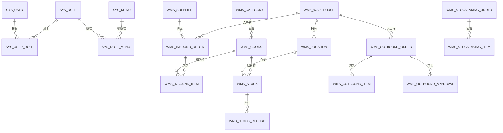

# 数据库设计文档

## 一、数据库概述

- 数据库类型:MySQL 8.0
- 字符集:utf8mb4_unicode_ci
- 存储引擎:InnoDB
- 数据库名:wms_db
- 表总数:13 张核心业务表 + 1 张日志表

## 二、E-R 图



## 三、表结构详述

### 3.1 sys_user(用户表)
| 字段 | 类型 | 约束 | 说明 |
|---|---|---|---|
| id | BIGINT | PK, AUTO_INCREMENT | 用户ID |
| username | VARCHAR(50) | NOT NULL, UNIQUE | 登录账号 |
| password | VARCHAR(100) | NOT NULL | BCrypt 加密 |
| real_name | VARCHAR(50) | | 真实姓名 |
| avatar | VARCHAR(255) | | 头像URL |
| phone | VARCHAR(20) | | 手机号 |
| email | VARCHAR(100) | | 邮箱 |
| dept_id | BIGINT | | 部门ID |
| status | TINYINT | DEFAULT 1 | 1启用/0停用 |
| last_login_time | DATETIME | | 最后登录时间 |
| last_login_ip | VARCHAR(50) | | 最后登录IP |
| remark | VARCHAR(255) | | 备注 |
| create_time | DATETIME | | 创建时间 |
| update_time | DATETIME | | 更新时间 |
| create_by | BIGINT | | 创建人 |
| update_by | BIGINT | | 更新人 |
| deleted | TINYINT | DEFAULT 0 | 逻辑删除 |

**索引**:UNIQUE uk_username(username)

(其余 12 张表按相同格式,字段说明见 `wms-db/02_create_tables.sql`)

## 四、关键设计说明

### 4.1 库存唯一性
`wms_stock` 联合唯一索引 `(goods_id, location_id, batch_no)`,同一商品在同一库位同一批次只能存在一条记录,保证库存数据一致性。

### 4.2 软删除
所有表包含 `deleted` 字段,使用 MyBatis-Plus `@TableLogic` 自动处理删除逻辑(逻辑删除 = 1 表示已删除)。

### 4.3 单据流水
`wms_stock_record` 流水表追加写入,包含业务类型、业务单号、变动前后数量,支持审计与回溯。

### 4.4 公共字段
所有业务表包含 `create_time/update_time/create_by/update_by/deleted` 五个公共字段,通过 MyBatis-Plus 自动填充。

## 五、初始化脚本

```bash
mysql -u root -p < wms-db/01_create_database.sql
mysql -u root -p wms_db < wms-db/02_create_tables.sql
mysql -u root -p wms_db < wms-db/03_seed_data.sql
```
